# 📱 MarketMate WhatsApp Bot

<p align="center">
  
</p>

> A production-ready AI-powered WhatsApp customer support bot built with **FastAPI**, **WhatsApp Cloud API (Meta)**, and **Ollama (offline LLM)**. Fully multilingual — detects and responds in the customer's language automatically.


---

## ✨ Features

- 📱 **WhatsApp integration** — Real customers message your WhatsApp Business number
- 🌍 **Fully multilingual** — Detects and responds in Turkish, English, German, Arabic, and more
- 🧠 **Offline AI (Ollama)** — LLaMA3 runs locally, no API costs, full data privacy
- 👤 **Customer info collection** — AI collects name, order number, and issue description
- 📦 **Order tracking** — Query MM-XXXX order status via chat
- 🏷️ **Product & campaign info** — Full catalog and active discounts
- 💬 **Conversation memory** — Context-aware replies per phone number
- 🚀 **Render.com ready** — One-click deploy with `render.yaml`

---

## 🏗 Architecture

```
Customer WhatsApp
        │
        ▼
Meta WhatsApp Cloud API
        │  POST /webhook
        ▼
FastAPI (Render.com)
        │
        ├─ Parse message
        ├─ Build conversation history
        │
        ▼
Ollama (LLaMA3) ◄── local or remote
        │
        ▼
AI response → send back via WhatsApp API
```

---

## 🚀 Setup Guide

### 1. Meta Developer Setup

1. Go to [developers.facebook.com](https://developers.facebook.com)
2. Create an App → **Business** type
3. Add **WhatsApp** product
4. Get your `WHATSAPP_TOKEN` and `WHATSAPP_PHONE_ID`
5. Set webhook URL: `https://your-app.onrender.com/webhook`
6. Verify token: `marketmate_verify_2025`
7. Subscribe to: `messages`

### 2. Install Ollama

```bash
curl -fsSL https://ollama.com/install.sh | sh
ollama pull llama3
ollama serve
```

### 3. Run locally

```bash
git clone https://github.com/yourusername/marketmate-whatsapp.git
cd marketmate-whatsapp
pip install -r requirements.txt
cp .env.example .env
uvicorn main:app --reload --port 8000
```

### 4. Test with ngrok

```bash
ngrok http 8000
```

### 5. Deploy to Render.com

Push to GitHub → connect repo on render.com → add env vars → deploy.

---

## 🌍 Multilingual Demo

| Customer writes | Bot responds in |
|---|---|
| "Siparişim nerede?" | 🇹🇷 Turkish |
| "Where is my order?" | 🇬🇧 English |
| "Wo ist meine Bestellung?" | 🇩🇪 German |
| "أين طلبي؟" | 🇸🇦 Arabic |

---

## 🛠 Tech Stack

| Component | Technology |
|---|---|
| Language | Python 3.11 |
| Webhook server | FastAPI |
| WhatsApp API | Meta WhatsApp Cloud API v19 |
| AI Model | LLaMA3 via Ollama (offline) |
| Deployment | Render.com |
| HTTP client | httpx (async) |

---

## 📄 License

MIT — Built by [Your Name] · [Upwork](https://upwork.com)
